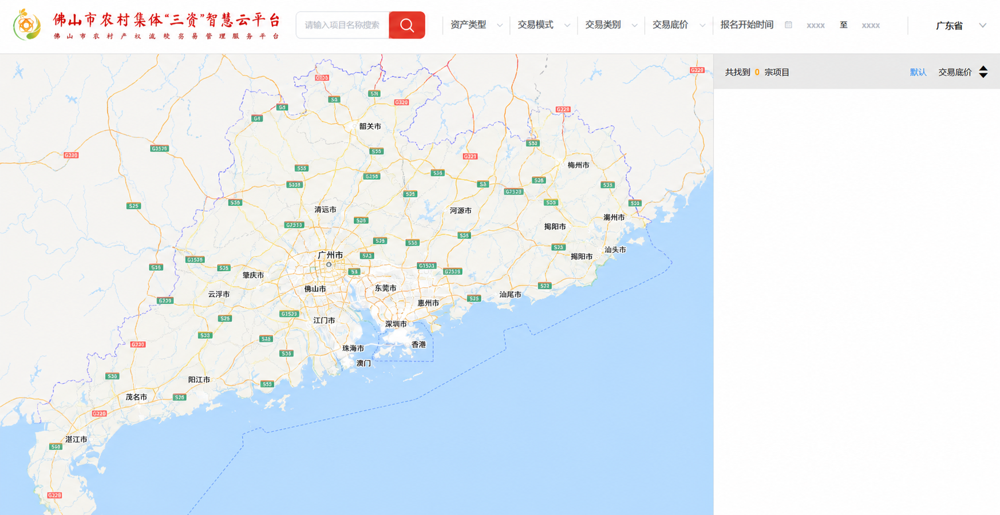

# 项目地图页面 UI V1 需求说明

## 1. 文档信息

- 页面名称：项目地图
- 版本：V1
- 当前阶段：需求整理与视觉预览
- 实现范围：纯前端页面、静态地区和筛选选项、可缩放和平移的广东省地图
- 数据范围：不接入真实项目、机构、交易、图片或统计数据

## 2. 页面目标

用户从首页点击“项目地图”后进入独立的项目地图页面。页面布局、字体、颜色、间距和控件样式参考原网站，地图范围由佛山市调整为广东省，右侧项目区域保持空白，只保留零项目统计和排序控件。

页面的核心视觉结构如下：

```text
┌──────────────────────────────────────────────────────────────┐
│ 品牌区 │ 搜索 │ 筛选条件 │ 报名时间               │ 广东省 │
├──────────────────────────────────────────┬───────────────────┤
│                                          │ 共找到 0 宗项目    │
│                                          │ 默认  交易底价     │
│              广东省地图                  ├───────────────────┤
│         支持用户缩放、拖动平移            │                   │
│                                          │   空白展示区域     │
│                                          │                   │
└──────────────────────────────────────────┴───────────────────┘
```

## 3. 页面入口与导航

- 首页顶部“项目地图”按钮改为可点击入口。
- 点击后进入项目地图独立页面，不打开原网站或其他外部链接。
- 第一版不提供项目详情页。
- 第一版不额外设计返回按钮，用户可使用浏览器返回操作。
- 页面采用桌面端全屏布局，不在本版本内进行移动端适配。

## 4. 页面整体布局

页面分为顶部筛选导航区和下方工作区：

- 顶部筛选导航区横向占满页面。
- 下方左侧为广东省地图，作为页面主要区域。
- 下方右侧为项目结果区域，保持原网站的固定侧栏比例。
- 地图区和结果区之间保留清晰的竖向分隔。
- 页面高度以浏览器可视区域为基准，地图区和结果区填满顶部导航以下的空间。

## 5. 顶部筛选导航区

顶部区域按照参考页面保留以下元素：

1. 平台标志、平台名称和副标题。
2. 项目名称搜索框。
3. 红色搜索按钮和白色放大镜图标。
4. 资产类型筛选。
5. 交易模式筛选。
6. 交易类别筛选。
7. 交易底价筛选。
8. 报名开始时间筛选。
9. 开始日期、`至`、结束日期。
10. 最右侧当前地区入口。

视觉要求：

- 左侧平台品牌名称保持现有网站名称。
- 最右侧原“佛山市”默认改为“广东省”。
- 顶部保持白色背景和单行桌面布局。
- 字体、字号、字重、颜色、边框、间距、分隔线、下拉箭头和地区下划线参考原网站。
- 搜索按钮使用醒目的红色圆角矩形样式。
- 日期区域保留日历图标和原网站相近的占位表现。

## 6. 搜索与筛选行为

### 6.1 项目搜索

- 输入框提示文字为“请输入项目名称搜索”。
- 用户可以输入文字。
- 点击搜索按钮不执行查询。
- 搜索不更新地图、项目数量或右侧内容。
- 搜索不发送接口请求。

### 6.2 筛选条件

需要保留以下筛选入口：

- 资产类型
- 交易模式
- 交易类别
- 交易底价
- 报名开始时间

交互规则：

- 点击筛选项可以打开本地静态下拉选项或日期选择界面。
- 用户选择后，控件自身可以显示本地选择结果。
- 选择不改变广东省地图的位置或缩放级别。
- 选择不改变右侧项目数量或空白内容区。
- 选择不触发搜索、排序、分页或接口请求。
- 筛选选项的具体枚举后续按照原网站静态整理，不接入后台字典。

## 7. 地区/机构选择

### 7.1 打开方式

- 点击顶部右侧“广东省”后打开“地区/机构选择”弹窗。
- 弹窗包含标题、右上角关闭按钮、树形地区列表和底部“确定”按钮。
- 弹窗尺寸、浅黄色选中背景、灰色文字、树形缩进、展开箭头和蓝色确定按钮参考原网站。

### 7.2 地区树

根节点为“广东省”，下级为广东省 21 个地级市：

- 广州市
- 深圳市
- 珠海市
- 汕头市
- 佛山市
- 韶关市
- 河源市
- 梅州市
- 惠州市
- 汕尾市
- 东莞市
- 中山市
- 江门市
- 阳江市
- 湛江市
- 茂名市
- 肇庆市
- 清远市
- 潮州市
- 揭阳市
- 云浮市

### 7.3 选择规则

- 默认选中“广东省”。
- 第一版采用单选。
- 选择城市并点击“确定”后，只更新顶部右侧当前地区名称。
- 例如选择“广州市”后，顶部右侧显示“广州市”。
- 地区选择不移动或缩放地图。
- 地区选择不筛选结果、不改变项目数量。
- 点击关闭按钮时不保存本次未确认的选择。

## 8. 广东省地图

### 8.1 默认状态

- 默认视野覆盖广东省。
- 地图可显示基础道路、水系、行政区和地名。
- 不显示项目点位、数量气泡、聚合点或交易标记。
- 不显示佛山市五区项目统计标记。
- 不加载真实项目坐标。

### 8.2 允许的地图交互

地图只允许因用户直接操作而变化：

- 鼠标拖动平移。
- 鼠标滚轮或触控板缩放。
- 地图组件提供的基础缩放操作。

以下操作不能改变地图：

- 输入或提交项目搜索。
- 选择筛选条件。
- 选择报名时间。
- 点击“默认”或“交易底价”。
- 在地区弹窗中选择广东省或任一城市。
- 点击右侧空白区域。

地图移动或缩放后，不刷新项目数量和右侧结果区域。

## 9. 右侧项目结果区域

### 9.1 顶部灰色状态条

必须显示以下内容：

- `共找到`
- 橙色数字 `0`
- `宗项目`
- `默认`
- `交易底价`
- 上下排序箭头

视觉要求：

- 状态条使用原网站相同或相近的浅灰色背景。
- “共找到”和“宗项目”使用深色文字。
- 数字 `0` 使用橙色并保持醒目。
- “默认”使用原网站的蓝色激活样式。
- “交易底价”和排序箭头使用原网站对应的深色样式。
- 字号、字重、间距和垂直对齐参考原网站。

### 9.2 排序行为

- “默认”和“交易底价”视觉上可点击。
- 点击后不切换排序状态。
- 点击后不改变字体颜色或箭头方向。
- 点击后不更新右侧内容。
- 点击后不发送接口请求。

### 9.3 空白内容区域

- 灰色状态条下方保持纯白空白。
- 不显示项目图片、名称或详情字段。
- 不显示权属单位、交易底价、报名时间或竞投时间。
- 不显示“暂无数据”文字、空状态图标或提示插画。
- 不显示分页器、每页条数、页码或前往按钮。
- 空白区域保留原网站结果列表对应的宽度和高度。

## 10. 交互影响矩阵

| 操作 | 控件自身可见变化 | 地图变化 | 项目数量变化 | 右侧内容变化 | 网络请求 |
| --- | --- | --- | --- | --- | --- |
| 输入项目名称 | 显示输入文字 | 无 | 无 | 无 | 无 |
| 点击搜索 | 无 | 无 | 无 | 无 | 无 |
| 选择筛选条件 | 可显示本地选择值 | 无 | 无 | 无 | 无 |
| 选择报名时间 | 可显示本地日期 | 无 | 无 | 无 | 无 |
| 选择城市并确定 | 更新右上角地区名称 | 无 | 无 | 无 | 无 |
| 点击默认排序 | 无 | 无 | 无 | 无 | 无 |
| 点击交易底价 | 无 | 无 | 无 | 无 | 无 |
| 拖动或缩放地图 | 地图视野改变 | 有 | 无 | 无 | 仅地图基础资源需要时发生 |

## 11. 数据与接口边界

第一版不接入：

- 项目搜索接口
- 项目列表接口
- 项目详情接口
- 项目数量统计接口
- 地区机构接口
- 筛选字典接口
- 地图项目点位接口
- 城市边界联动接口
- 排序接口
- 分页接口

所有地区、筛选项和展示文字均使用本地静态数据。若地图采用在线底图，底图资源请求不视为项目业务接口，但不得携带真实项目数据。

## 12. 明确不在本版本实现

- 真实项目卡片和缩略图
- 地图项目标记和数量气泡
- 地图与右侧列表联动
- 地区选择后的自动定位
- 条件筛选后的结果刷新
- 项目详情和报名流程
- 排序和分页能力
- 后台管理、数据库或内容管理系统
- 移动端响应式重构

## 13. 验收标准

- 首页“项目地图”能够进入独立页面。
- 页面顶部结构与参考页面基本一致。
- 右上角默认显示“广东省”。
- 地区弹窗包含广东省及 21 个地级市。
- 选择城市只更新右上角地区名称。
- 搜索和筛选控件完整可见，但不会改变地图或结果。
- 广东省地图可以由用户缩放和平移。
- 地图不会因搜索、筛选、排序或地区选择发生变化。
- 右侧状态条准确显示“共找到0宗项目”。
- “默认”和“交易底价”的字体、颜色和箭头与参考页面一致。
- 右侧状态条以下完全留白。
- 页面不加载任何真实项目、图片、出租信息或交易数据。

## 14. 预计效果图

下图用于表达第一版默认状态的页面结构与视觉方向，不作为最终像素级验收基线：


