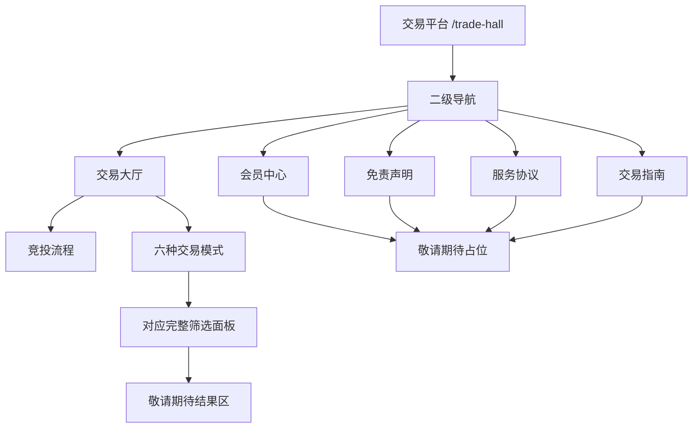

# 交易平台第二阶段界面需求说明

## 1. 文档信息

| 项目 | 内容 |
| --- | --- |
| 需求名称 | 交易平台第二阶段界面扩展 |
| 对应页面 | `/trade-hall` |
| 基础版本 | 已完成的交易大厅第一版首屏 |
| 需求性质 | 纯前端界面与本地交互演示 |
| 数据状态 | 不接入任何真实项目、会员、协议或交易数据 |
| 原站参考 | 佛山市农村集体“三资”智慧云平台交易系统 |

## 2. 需求目标

在现有交易大厅首屏下方补齐原站交易平台的主要可见结构，包括竞投流程、六种交易模式、完整筛选面板和二级导航页面。所有选项都可以点击或输入，但无论用户如何切换和筛选，系统都不查询、不生成也不展示真实项目信息，统一显示“敬请期待”占位。

## 3. 本期范围

### 3.1 本期包含

- 竞投流程横向展示。
- 六种交易模式切换。
- 各模式对应的完整筛选选项。
- 筛选选中、清除、收起/展开、自定义金额、日期和关键字输入。
- “会员中心、免责声明、服务协议、交易指南”可点击占位页。
- 固定“顶部”按钮。
- 结果区统一“敬请期待...”占位。
- 不显示二维码。

### 3.2 本期不包含

- 后端接口、数据库和真实项目数据。
- 搜索查询、结果排序、数量统计和分页。
- 项目详情、报名、保证金、竞投、出价、合同等实际业务。
- 登录、注册、会员资料和账号状态。
- 免责声明、服务协议、交易指南正文。
- 二维码、小程序码或扫码入口。

## 4. 页面状态结构

## 5. 页面纵向排版

交易大厅激活时，页面从上到下依次为：

1. 已完成的欢迎栏、品牌区和交易大厅搜索区。
2. 红色二级导航。
3. “竞投流程”横向步骤带。
4. 六种交易模式页签和右侧灰色“默认排序”。
5. “已选条件”栏、清除/收起按钮和完整筛选面板。
6. “敬请期待...”结果占位区。
7. 视口右下固定的红色“顶部”按钮。

会员中心、免责声明、服务协议或交易指南激活时，保留第 1、2、7 项，内容区只显示“敬请期待”占位。

## 6. 二级导航需求

导航顺序保持：

1. 交易大厅
2. 会员中心
3. 免责声明
4. 服务协议
5. 交易指南
6. `>> 佛山市农村集体“三资”智慧云平台`

交互规则：

- 默认激活“交易大厅”，使用黄色背景、白色文字。
- 点击前五项中的任意一项后，被点击项切换为黄色激活态。
- 点击“会员中心、免责声明、服务协议、交易指南”后，竞投流程、模式和筛选面板隐藏，内容区显示统一占位。
- 点击“交易大厅”恢复完整交易大厅内容。
- 最右侧智慧云平台入口保持现有功能，点击返回首页。

## 7. 竞投流程

竞投流程按原站横向展示八个步骤：

| 顺序 | 步骤文字 |
| --- | --- |
| 1 | 阅读公告 |
| 2 | 报名获取保证金账户 |
| 3 | 缴纳交易保证金 |
| 4 | 资格审核、优先权审核 |
| 5 | 出价竞投 |
| 6 | 结果公示 |
| 7 | 合同签订 |
| 8 | 交易结束 |

视觉要求：

- 顶部居中显示红色“竞投流程”标题装饰。
- 每个步骤使用粉红色圆形图标，圆形下方显示步骤文字。
- 相邻步骤之间使用橙红色双箭头连接。
- 图标可使用本地 CSS 或本地矢量图形近似，不引用原站图片。
- 八个步骤仅展示，不提供点击功能。

## 8. 六种交易模式

| 顺序 | 模式 | 筛选类型 |
| --- | --- | --- |
| 1 | 网上竞投 | 公共竞投筛选 |
| 2 | 网上竞投（批量） | 公共竞投筛选 |
| 3 | 简易竞投 | 公共竞投筛选 |
| 4 | 公开协商 | 协商专用筛选 |
| 5 | 定价招租 | 招租专用状态筛选 |
| 6 | 书面竞投 | 公共竞投筛选 |

交互规则：

- 默认激活“网上竞投”。
- 激活页签使用红色背景、白色文字和下方红色小三角。
- 未激活页签使用浅红背景、红色文字。
- 点击页签后切换筛选配置。
- 切换模式时，筛选条件恢复默认“不限”，所有自定义输入清空。
- 切换后结果区仍显示“敬请期待...”。

## 9. 筛选面板公共结构

### 9.1 顶部操作区

- 左侧显示“已选条件：”。
- 非默认选项以条件标签或文字形式同步显示。
- 右上显示“清除”和“收起”。
- 点击“清除”恢复所有“不限”并清空金额、日期和关键字。
- 点击“收起”隐藏详细筛选行，文字变为“展开”；再次点击恢复。
- 模式页签右侧显示灰色“默认排序”控件，本期不可操作。

### 9.2 所属区

所有模式统一显示：

`不限、禅城区、南海区、顺德区、高明区、三水区`

### 9.3 资产类别

所有模式按顺序显示：

`不限、耕地、园地、林地、草地、农田水利设施用地 (沟渠)、养殖水面(坑塘水面)、其他农用地、未利用地、“四荒”地、其他土地资产、商铺、厂房、仓库、办公楼、市场、临时建筑、商住楼、其他物业、其他固定资产`

### 9.4 交易底价

预设选项：

`不限、0-1999、2000-4999、5000-9999、10000以上、自定义金额`

选择“自定义金额”后显示：

- 起始金额输入框。
- 结束金额输入框。
- 两个输入框中间显示短横线。
- “确定”按钮。

### 9.5 交易时间和发布日期

两个筛选组都显示：

`不限、近一周内、近两周内、近一个月内、自定义日期`

选择“自定义日期”后显示：

- 开始日期输入框。
- “至”。
- 结束日期输入框。
- “确定”按钮。

### 9.6 关键字

- 显示一个文本输入框。
- 输入框右侧显示“确定”按钮。
- 输入与点击只保留本地状态，不触发搜索。

## 10. 各模式差异

### 10.1 公共竞投筛选

适用于：网上竞投、网上竞投（批量）、简易竞投、书面竞投。

交易类别：

`不限、出租、出让、发包、其他`

交易状态：

`不限、即将报名、正在报名、即将竞投、正在竞投、结束竞投、完成交易、流拍、弃拍、异议、项目终止`

### 10.2 公开协商筛选

交易类别：

`不限、出租、出让、发包、入股（合作）、出租+分成、其他`

协商状态：

`不限、正在报名、即将协商、协商中、结束协商、完成交易、流拍、弃拍、异议、项目终止`

协商方式：

`不限、遴选、一对一磋商`

### 10.3 定价招租筛选

交易类别：

`不限、出租、出让、发包、其他`

交易状态：

`不限、即将报名、正在报名、结束招租、完成交易、流拍、弃拍、项目终止`

## 11. 筛选选择规则

- 每个筛选组为单选。
- 默认选择“不限”。
- 点击普通选项后，该选项显示红色背景和白色文字，同组选项取消选中。
- 自定义金额、日期和关键字允许输入。
- 所有“确定”按钮只确认本地状态，不请求接口。
- 不论选择任何条件，结果区域内容都不改变。
- 页面 URL 不因筛选变化。

## 12. 敬请期待占位

交易结果区和四个辅助导航页统一显示：

- 浅灰色法槌图形。
- 主文案：`敬请期待...`
- 英文副文案：`Coming soon...`

占位区不得出现：

- “暂无公开数据”。
- 项目卡片或项目列表。
- 项目数量、统计数字。
- 分页控件。
- 真实图片、价格、报名时间等项目字段。

## 13. 二维码限制

交易平台全部状态中都不得显示：

- 二维码或小程序码。
- “点击扫码”等提示。
- 二维码灰色占位框。
- 右侧悬浮扫码栏。

## 14. 返回顶部按钮

- 与当前首页现有按钮保持一致。
- 固定在视口右下区域。
- 红色矩形、轻微圆角和阴影。
- 按钮内显示白色向上箭头和“顶部”。
- 点击后平滑滚动到页面顶部。
- 交易大厅和四个辅助导航页面均保留该按钮。

## 15. 数据与网络边界

- 所有数据均为前端固定配置。
- 不访问原站图片、脚本或接口。
- 不调用搜索、交易、项目、会员或协议接口。
- 不使用本地持久化保存筛选条件。
- 刷新页面后恢复“交易大厅 / 网上竞投 / 全部不限”的默认状态。

## 16. 验收标准

1. 二级导航、八步竞投流程和六种交易模式的顺序正确。
2. 六种模式都能点击切换，并显示正确的筛选差异。
3. 所属区、资产类别、底价、时间、发布日期和关键字选项完整。
4. 选项可以选择，选中态、已选条件、清除和收起/展开有效。
5. 任何选择后结果始终显示“敬请期待... / Coming soon...”。
6. 四个辅助导航可点击并显示敬请期待占位。
7. 页面中没有二维码、项目列表、数量和分页。
8. “顶部”按钮外观与首页一致并可返回顶部。
9. 所有操作不产生原站或交易接口请求。
10. 1366、1440、1920 像素桌面宽度下无文字重叠、重要内容裁切或页面横向溢出。

## 17. 后续预留

以下能力仅预留结构，本期不实现：

- 真实条件查询和排序。
- 项目卡片与列表分页。
- 会员登录注册。
- 免责声明、服务协议和交易指南正文。
- 竞投报名、保证金、报价和交易流程。
